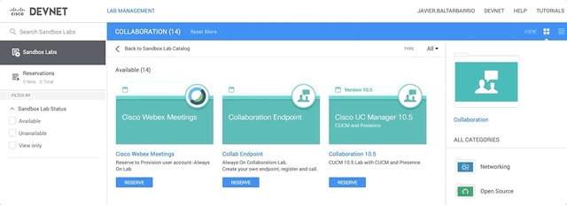

  <a href="#Getting-Started">Getting Started</a> •
  <a href="#Prerequisites">Prerequisites</a> •
  <a href="#Installing">Installing</a> •
  <a href="#Next-Steps">Next Steps</a> •
  <a href="#related">Related</a> •
  <a href="#license">License</a>

# cucm-python-workshop
Cisco Call Manager Python AXL API Programming Tools

## Getting Started

#### Relevant Libraries

zeep

`$ python --version`

#### Cisco DevNet Sandboxes
https://devnetsandbox.cisco.com/RM/Topology

#### Toolkit

- Python. I am using Python 2 and PyCharm IDE.
- A CUCM instance
- AXLSQLToolkit 
- zeep
- A Coffee mug 

## Next Steps
#### Export to CSV 

#### Export to SQLite

`$ import sqlite3

con_obj = sqlite3.connect("test.db")
with con_obj:
            cur_obj = con_obj.cursor()
            cur_obj.execute("""CREATE TABLE books(title text, author text)""")

print ("Table created")`

`

## Related

* [Cisco Administrative XML (AXL)](https://developer.cisco.com/site/axl/) - AXL is a Soap based API that enables remote provisioning of Unified CM

 

## Authors

* **Javier Baltar** - *Initial work* - [GitHub](https://github.com/JavierBaltar)

## Licence
